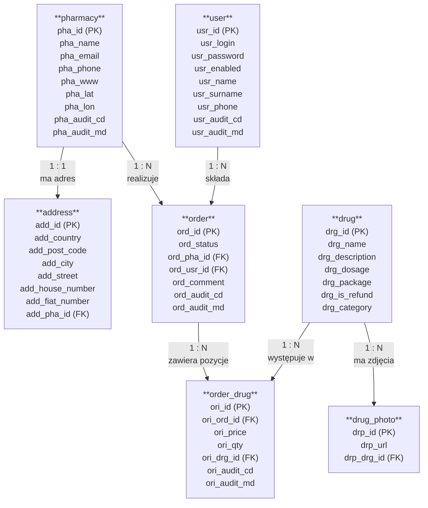

# Ćwiczenie 1 — MySQL, Docker i podstawy SQL

## Cel ćwiczenia

Celem ćwiczenia jest zapoznanie się z:
- uruchomieniem bazy danych MySQL w kontenerze Docker,
- połączeniem z bazą danych przy pomocy klienta GUI,
- wczytaniem struktury i danych przykładowej bazy,
- wykonywaniem podstawowych zapytań SQL do pobierania, filtrowania i sortowania danych.

Ćwiczenie bazuje na przykładowej bazie **`example_db`**, która przedstawia uproszczony model systemu do obsługi zamówień leków w aptekach.

---

## Zasady oddania

Do każdego zadania należy dołączyć:
- zrzut ekranu z zapytaniem i wynikiem,
- dodatkowy plik `.txt` albo `.sql` zawierający wszystkie rozwiązania,
- numerację zapytań zgodną z numeracją zadań.

Proszę formatować zapytania tak, aby sekcje takie jak:
`SELECT`, `FROM`, `WHERE`, `ORDER BY`, `GROUP BY`
zaczynały się od nowej linii.

---

## Punktacja

Do zdobycia jest **10 punktów**.

Skala ocen:
- **0–4.5 pkt** → 2.0
- **5–5.5 pkt** → 3.0
- **6–6.5 pkt** → 3.5
- **7–8 pkt** → 4.0
- **8.5–9 pkt** → 4.5
- **9.5–10 pkt** → 5.0

---

## Schemat bazy danych

Poniżej znajduje się diagram ERD przedstawiający strukturę przykładowej bazy danych `example_db`.



## Opis tabel

### `pharmacy` — apteki
Tabela przechowuje dane aptek:
- identyfikator apteki,
- nazwę,
- adres e-mail,
- telefon,
- stronę internetową,
- współrzędne geograficzne,
- datę utworzenia i modyfikacji rekordu.

### `address` — adresy aptek
Tabela zawiera dane adresowe przypisane do aptek:
- kraj,
- kod pocztowy,
- miasto,
- ulicę,
- numer domu,
- numer mieszkania,
- identyfikator apteki, do której należy adres.

### `drug` — leki
Tabela przechowuje informacje o lekach:
- nazwę leku,
- opis,
- dawkowanie,
- rodzaj opakowania,
- informację, czy lek jest refundowany,
- kategorię leku.

### `drug_photo` — zdjęcia leków
Tabela zawiera adresy URL zdjęć przypisanych do leków.

### `user` — użytkownicy
Tabela przechowuje dane użytkowników systemu:
- login,
- hasło,
- status aktywności konta,
- imię,
- nazwisko,
- numer telefonu,
- datę utworzenia i modyfikacji rekordu.

### `order` — zamówienia
Tabela zawiera dane zamówień:
- status zamówienia,
- identyfikator apteki,
- identyfikator użytkownika,
- komentarz,
- datę utworzenia i modyfikacji.


### `order_drug` — pozycje zamówień
Tabela łączy zamówienia z lekami i opisuje konkretne pozycje zamówienia:
- identyfikator zamówienia,
- identyfikator leku,
- cenę,
- ilość,
- datę utworzenia i modyfikacji.

## Relacje między tabelami

- Jedna apteka ma jeden adres.
- Jedna apteka może realizować wiele zamówień.
- Jeden użytkownik może złożyć wiele zamówień.
- Jedno zamówienie może zawierać wiele pozycji.
- Jeden lek może występować w wielu pozycjach zamówień.
- Jeden lek może mieć wiele zdjęć.

---

# Część 1. Instalacja i uruchomienie środowiska

## 1. Instalacja Dockera

Zainstaluj Docker na swoim komputerze.

Rekomendacje:
- **Windows**: Docker Desktop
- **macOS**: Docker Desktop
- **Ubuntu / Linux**: Docker Engine lub Docker Desktop

Po instalacji sprawdź w terminalu, czy Docker działa poprawnie:

```bash
docker --version
docker-compose --version
```

Jeżeli korzystasz z nowszej wersji Dockera, możesz też użyć:

```bash
docker compose version
```

---

## 2. Plik Docker Compose

Poniżej znajduje się pełna zawartość pliku `mysql-docker-compose.yml`, którego używamy w ćwiczeniu.

```yaml
version: '3.8'

services:
  mysql:
    image: mysql:latest
    container_name: mysql-container
    environment:
      MYSQL_ROOT_PASSWORD: root
      MYSQL_DATABASE: example_db
      MYSQL_USER: admin
      MYSQL_PASSWORD: password
    ports:
      - "3306:3306"
    restart: always
```

### Co robi ten plik?

Ten plik:
- uruchamia kontener MySQL,
- tworzy bazę danych `example_db`,
- tworzy użytkownika `admin`,
- ustawia hasło użytkownika `admin` na `password`,
- wystawia MySQL lokalnie na porcie `3306`.

### Dane połączeniowe

Używane w ćwiczeniu dane połączeniowe:
- **Host**: `127.0.0.1`
- **Port**: `3306`
- **Database**: `example_db`
- **User**: `admin`
- **Password**: `password`

Dodatkowo konto administratora:
- **Root password**: `root`

---

## 3. Uruchomienie kontenera

1. Zapisz plik `mysql-docker-compose.yml` w wybranym katalogu.
2. Otwórz terminal / CMD / PowerShell.
3. Przejdź do katalogu z tym plikiem.
4. Uruchom:

```bash
docker-compose -f mysql-docker-compose.yml -p dsw-sql up -d
```

Jeżeli używasz nowego składnika Compose, możesz użyć także:

```bash
docker compose -f mysql-docker-compose.yml -p dsw-sql up -d
```

Po uruchomieniu Docker powinien pobrać obraz MySQL i wystartować kontener.

### Sprawdzenie działania kontenera

```bash
docker ps
```

### Zatrzymanie środowiska

```bash
docker-compose -f mysql-docker-compose.yml -p dsw-sql down
```

lub:

```bash
docker compose -f mysql-docker-compose.yml -p dsw-sql down
```

---

# Część 2. Połączenie z bazą danych

## 4. MySQL Workbench

Do połączenia z bazą możesz użyć **MySQL Workbench**.

Po zainstalowaniu:
1. Uruchom program.
2. Kliknij **plus** przy „MySQL Connections”.
3. Uzupełnij dane połączenia:
   - Hostname: `127.0.0.1`
   - Port: `3306`
   - Username: `admin`
   - Password: `password`
4. Kliknij **Test Connection**.
5. Zatwierdź połączenie.

Po połączeniu można podejrzeć bazy danych poleceniem:

```sql
SHOW DATABASES;
```

Na początku baza `example_db` istnieje, ale nie zawiera jeszcze tabel — trzeba je dopiero utworzyć.

---

# Część 3. Tworzenie bazy i wczytanie danych

## 5. Skrypt tworzący tabele

Uruchom najpierw poniższy skrypt:

**Plik:** `create example-db tables.sql`

```sql
USE example_db;

CREATE TABLE pharmacy (
    pha_id BIGINT PRIMARY KEY,
    pha_name VARCHAR(100) NOT NULL,
    pha_email VARCHAR(100) NOT NULL,
    pha_phone VARCHAR(100) NOT NULL,
    pha_www VARCHAR(100),
    pha_lat DECIMAL(9,6),
    pha_lon DECIMAL(9,6),
    pha_audit_cd DATETIME NOT NULL DEFAULT CURRENT_TIMESTAMP,
    pha_audit_md DATETIME NOT NULL DEFAULT CURRENT_TIMESTAMP ON UPDATE CURRENT_TIMESTAMP
);

CREATE TABLE address (
    add_id BIGINT PRIMARY KEY,
    add_country VARCHAR(50) NOT NULL,
    add_post_code VARCHAR(11) NOT NULL,
    add_city VARCHAR(40) NOT NULL,
    add_street VARCHAR(75) NOT NULL,
    add_house_number VARCHAR(10) NOT NULL,
    add_fiat_number VARCHAR(10),
    add_pha_id BIGINT NOT NULL,
    FOREIGN KEY (add_pha_id) REFERENCES pharmacy(pha_id)
);

CREATE TABLE drug (
    drg_id BIGINT PRIMARY KEY,
    drg_name VARCHAR(100) NOT NULL,
    drg_description VARCHAR(255) NOT NULL,
    drg_dosage VARCHAR(50) NOT NULL,
    drg_package VARCHAR(50) NOT NULL,
    drg_is_refund BIT NOT NULL,
    drg_category BIGINT NOT NULL
);

CREATE TABLE drug_photo (
    drp_id BIGINT PRIMARY KEY,
    drp_url VARCHAR(255) NOT NULL,
    drp_drg_id BIGINT NOT NULL,
    FOREIGN KEY (drp_drg_id) REFERENCES drug(drg_id)
);

CREATE TABLE user (
    usr_id BIGINT PRIMARY KEY,
    usr_login VARCHAR(254) NOT NULL,
    usr_password VARCHAR(100) NOT NULL,
    usr_enabled BIT NOT NULL,
    usr_name VARCHAR(50),
    usr_surname VARCHAR(50),
    usr_phone VARCHAR(50),
    usr_audit_cd DATETIME NOT NULL DEFAULT CURRENT_TIMESTAMP,
    usr_audit_md DATETIME NOT NULL DEFAULT CURRENT_TIMESTAMP ON UPDATE CURRENT_TIMESTAMP
);

CREATE TABLE `order` (
    ord_id BIGINT PRIMARY KEY,
    ord_status VARCHAR(20) NOT NULL,
    ord_pha_id BIGINT NOT NULL,
    ord_usr_id BIGINT NOT NULL,
    ord_comment VARCHAR(255),
    ord_audit_cd DATETIME NOT NULL DEFAULT CURRENT_TIMESTAMP,
    ord_audit_md DATETIME NOT NULL DEFAULT CURRENT_TIMESTAMP ON UPDATE CURRENT_TIMESTAMP,
    FOREIGN KEY (ord_pha_id) REFERENCES pharmacy(pha_id),
    FOREIGN KEY (ord_usr_id) REFERENCES user(usr_id)
);

CREATE TABLE order_drug (
    ori_id BIGINT PRIMARY KEY,
    ori_ord_id BIGINT NOT NULL,
    ori_price DECIMAL(10,2) NOT NULL,
    ori_qty INT NOT NULL,
    ori_drg_id BIGINT NOT NULL,
    ori_audit_cd DATETIME NOT NULL DEFAULT CURRENT_TIMESTAMP,
    ori_audit_md DATETIME NOT NULL DEFAULT CURRENT_TIMESTAMP ON UPDATE CURRENT_TIMESTAMP,
    FOREIGN KEY (ori_ord_id) REFERENCES `order`(ord_id),
    FOREIGN KEY (ori_drg_id) REFERENCES drug(drg_id)
);
```

---

## 6. Skrypt inicjalizujący dane

Następnie uruchom drugi skrypt:

**Plik:** `Initialize example-db tables with data.sql`

```sql
USE example_db;

-- Add pharmacy data 
INSERT INTO pharmacy (pha_id, pha_name, pha_email, pha_phone, pha_www, pha_lat, pha_lon, pha_audit_cd, pha_audit_md)
VALUES 
(1, 'Apteka Wrocław Centrum', 'kontakt@apteka-centrum.pl', '123456789', 'www.apteka-centrum.pl', 51.1079, 17.0385, NOW(), NOW()),
(2, 'Apteka Wrocław Północ', 'kontakt@apteka-polnoc.pl', '987654321', 'www.apteka-polnoc.pl', 51.1500, 17.0800, NOW(), NOW()),
(3, 'Apteka Wrocław Zachód', 'kontakt@apteka-zachod.pl', '333222111', 'www.apteka-zachod.pl', 51.1200, 17.0400, NOW(), NOW()),
(4, 'Apteka Wrocław Południe', 'kontakt@apteka-poludnie.pl', '111222333', 'www.apteka-poludnie.pl', 51.1100, 17.0200, NOW(), NOW());

-- Add pharmacy address data 
INSERT INTO address (add_id, add_country, add_post_code, add_city, add_street, add_house_number, add_fiat_number, add_pha_id)
VALUES 
(1, 'Polska', '50-001', 'Wrocław', 'Świdnicka', '10', NULL, 1),
(2, 'Polska', '51-200', 'Wrocław', 'Legnicka', '20', '5', 2),
(3, 'Polska', '51-300', 'Wrocław', 'Gorlicka', '31', '1', 3),
(4, 'Polska', '51-400', 'Wrocław', 'Adama Kopycińskiego', '11', '3', 4);
 
 -- Add medications
 INSERT INTO drug (drg_id, drg_name, drg_description, drg_dosage, drg_package, drg_is_refund, drg_category)
VALUES 
(1, 'Paracetamol', 'Lek przeciwbólowy i przeciwgorączkowy', '500mg', '20 tabletek', 1, 1),
(2, 'Ibuprofen', 'Lek przeciwzapalny i przeciwgorączkowy', '400mg', '30 tabletek', 1, 1),
(3, 'Aspiryna', 'Lek przeciwbólowy, rozrzedzający krew', '500mg', '20 tabletek', 0, 1),
(4, 'Amoksycylina', 'Antybiotyk szerokiego spektrum', '250mg', '16 kapsułek', 1, 2),
(5, 'Metformina', 'Lek na cukrzycę typu 2', '850mg', '60 tabletek', 1, 3),
(6, 'Loratadyna', 'Lek na alergię', '10mg', '30 tabletek', 0, 4),
(7, 'Omeprazol', 'Lek na refluks żołądkowy', '20mg', '28 kapsułek', 1, 5),
(8, 'Simvastatyna', 'Lek obniżający cholesterol', '40mg', '30 tabletek', 1, 6),
(9, 'Losartan', 'Lek na nadciśnienie', '50mg', '30 tabletek', 1, 7),
(10, 'Salbutamol', 'Lek rozszerzający oskrzela', '100mcg', 'Inhalator', 1, 8);

--  Add medications photos

INSERT INTO drug_photo (drp_id, drp_url, drp_drg_id)
VALUES 
(1, 'https://example.com/paracetamol.jpg', 1),
(2, 'https://example.com/ibuprofen.jpg', 2),
(3, 'https://example.com/aspiryna.jpg', 3),
(4, 'https://example.com/amoksycylina.jpg', 4),
(5, 'https://example.com/metformina.jpg', 5);

-- Add users that will have not orders

INSERT INTO user (usr_id, usr_login, usr_password, usr_enabled, usr_name, usr_surname, usr_phone, usr_audit_cd, usr_audit_md)
VALUES 
(1, 'adam.kowalski', 'hashed_password1', 1, 'Adam', 'Kowalski', '111222333', NOW(), NOW()),
(2, 'ewa.nowak', 'hashed_password2', 1, 'Ewa', 'Nowak', '444555666', NOW(), NOW()),
(3, 'jan.kowalczyk', 'hashed_password3', 1, 'Jan', 'Kowalczyk', '777888999', NOW(), NOW()),
(4, 'alicja.malinowska', 'hashed_password4', 1, 'Alicja', 'Malinowska', '222333444', NOW(), NOW()),
(5, 'marek.wisniewski', 'hashed_password5', 1, 'Marek', 'Wiśniewski', '555666777', NOW(), NOW());

--  add users that will have some orders

INSERT INTO user (usr_id, usr_login, usr_password, usr_enabled, usr_name, usr_surname, usr_phone, usr_audit_cd, usr_audit_md)
VALUES 
(6, 'piotr.zielinski', 'hashed_password6', 1, 'Piotr', 'Zieliński', '123456789', NOW(), NOW()),
(7, 'anna.wojciechowska', 'hashed_password7', 1, 'Anna', 'Wojciechowska', '987654321', NOW(), NOW()),
(8, 'tomasz.kaczmarek', 'hashed_password8', 1, 'Tomasz', 'Kaczmarek', '321654987', NOW(), NOW()),
(9, 'katarzyna.dabrowska', 'hashed_password9', 1, 'Katarzyna', 'Dąbrowska', '741852963', NOW(), NOW()),
(10, 'lukasz.nowicki', 'hashed_password10', 1, 'Łukasz', 'Nowicki', '96352741', NOW(), NOW()),
(11, 'paulina.lewandowska', 'hashed_password11', 1, 'Paulina', 'Lewandowska', '852741369', NOW(), NOW()),
(12, 'grzegorz.szymanski', 'hashed_password12', 1, 'Grzegorz', 'Szymański', '369258147', NOW(), NOW()),
(13, 'monika.kwiatkowska', 'hashed_password13', 1, 'Monika', 'Kwiatkowska', '258147369', NOW(), NOW());

-- Add orders
INSERT INTO `order` (ord_id, ord_status, ord_pha_id, ord_usr_id, ord_comment, ord_audit_cd, ord_audit_md)
VALUES 
(1, 'DONE', 1, 6, 'Zamówienie na leki przeciwbólowe', NOW(), NOW()),
(2, 'DONE', 2, 7, 'Pilne zamówienie antybiotyków', NOW(), NOW()),
(3, 'IN_DELIVERY', 1, 8, 'Leki na alergię i cholesterol', NOW(), NOW()),
(4, 'RECEIVED', 2, 9, 'Dostawa do domu', NOW(), NOW()),
(5, 'IN_DELIVERY', 1, 11, 'Leki dla całej rodziny', NOW(), NOW()),
(6, 'RECEIVED', 2, 12, 'Suplementy diety', NOW(), NOW()),
(7, 'RECEIVED', 1, 13, 'Leki na receptę', NOW(), NOW());

-- Add orders for user with id 10
INSERT INTO `order` (ord_id, ord_status, ord_pha_id, ord_usr_id, ord_comment, ord_audit_cd, ord_audit_md)
VALUES 
(8, 'RECEIVED', 1, 10, 'Zamówienie z 2025', '2025-03-15 10:30:00', '2025-03-13 10:30:00'),
(9, 'IN_DELIVERY', 1, 10, 'Zamówienie z 2025', '2025-03-01 14:10:00', '2025-03-01 14:10:00'),
(10, 'DONE', 1, 10, 'Zamówienie z 2025', '2025-01-05 18:45:00', '2025-01-05 18:45:00'),
(11, 'DONE', 2, 10, 'Zamówienie z 2025', '2025-02-20 09:05:00', '2025-02-20 09:05:00'),
(12, 'DONE', 1, 10, 'Zamówienie z 2024', '2024-02-20 08:15:00', '2024-02-10 08:15:00'),
(13, 'DONE', 2, 10, 'Zamówienie z 2024', '2024-06-18 16:30:00', '2024-06-18 16:30:00'),
(14, 'DONE', 1, 10, 'Zamówienie z 2024', '2024-11-28 21:00:00', '2024-11-28 21:00:00'),
(15, 'DONE', 2, 10, 'Zamówienie z 2023', '2023-05-14 12:45:00', '2023-05-14 12:45:00'),
(16, 'DONE', 3, 10, 'Zamówienie z 2023', '2023-05-14 11:45:00', '2023-04-14 11:45:00');


-- Add medications to orders
INSERT INTO order_drug (ori_id, ori_ord_id, ori_price, ori_qty, ori_drg_id, ori_audit_cd, ori_audit_md)
VALUES 
(1, 1, 19.99, 2, 1, NOW(), NOW()),
(2, 1, 15.50, 1, 2, NOW(), NOW()),
(3, 2, 22.00, 3, 3, NOW(), NOW()),
(4, 3, 29.99, 1, 4, NOW(), NOW()),
(5, 3, 18.75, 2, 5, NOW(), NOW()),
(6, 4, 27.50, 1, 6, NOW(), NOW()),
(7, 5, 30.00, 4, 7, NOW(), NOW()),
(8, 6, 10.00, 2, 8, NOW(), NOW()),
(9, 7, 12.50, 1, 9, NOW(), NOW());

-- Add medications to orders made by user with id 10
INSERT INTO order_drug (ori_id, ori_ord_id, ori_price, ori_qty, ori_drg_id, ori_audit_cd, ori_audit_md)
VALUES 
(10, 8, 11.99, 2, 1, '2025-03-15 10:30:00', '2025-03-15 10:30:00'),
(11, 8, 24.50, 3, 2, '2025-03-15 10:30:00', '2025-03-15 10:30:00'),
(12, 9, 16.99, 1, 3, '2025-07-22 14:10:00', '2025-07-22 14:10:00'),
(13, 9, 28.75, 5, 4, '2025-07-22 14:10:00', '2025-07-22 14:10:00'),
(14, 10, 19.99, 3, 5, '2025-10-05 18:45:00', '2025-10-05 18:45:00'),
(15, 10, 25.50, 2, 6, '2025-10-05 18:45:00', '2025-10-05 18:45:00'),
(16, 11, 21.00, 2, 7, '2025-12-20 09:05:00', '2025-12-20 09:05:00'),
(17, 11, 14.75, 5, 8, '2025-12-20 09:05:00', '2025-12-20 09:05:00'),
(18, 12, 32.99, 1, 9, '2024-02-10 08:15:00', '2024-02-10 08:15:00'),
(19, 12, 17.50, 3, 10, '2024-02-10 08:15:00', '2024-02-10 08:15:00'),
(20, 13, 29.99, 1, 1, '2024-06-18 16:30:00', '2024-06-18 16:30:00'),
(21, 13, 18.25, 4, 2, '2024-06-18 16:30:00', '2024-06-18 16:30:00'),
(22, 14, 22.00, 2, 3, '2024-11-28 21:00:00', '2024-11-28 21:00:00'),
(23, 14, 19.99, 3, 4, '2024-11-28 21:00:00', '2024-11-28 21:00:00'),
(24, 15, 25.50, 2, 5, '2023-05-14 12:45:00', '2023-05-14 12:45:00'),
(25, 15, 28.00, 1, 6, '2023-05-14 12:45:00', '2023-05-14 12:45:00'),
(26, 16, 28.00, 1, 2, '2023-05-14 11:45:00', '2023-05-14 11:45:00');

```

---

## 7. Szybka weryfikacja

Po wykonaniu obu skryptów możesz sprawdzić, czy baza działa poprawnie:

```sql
SHOW TABLES;
```

```sql
SELECT * FROM drug LIMIT 5;
```

```sql
SELECT * FROM `order`;
```

> Uwaga: tabela `order` ma nazwę będącą słowem kluczowym SQL, dlatego należy używać backticków:
> ```sql
> SELECT * FROM `order`;
> ```

---

# Część 4. Zadania

## Zadanie 1 (1 pkt)

Wyszukaj wszystkie leki z tabeli `drug`.

Użyj słowa kluczowego `LIMIT`, aby ograniczyć wynik do **5 rekordów**.

---

## Zadanie 2 (1 pkt)

Wyszukaj wszystkie leki z tabeli `drug`, których opis zawiera słowo:

`przeciwzapalny`

**Wskazówka:** użyj operatora `LIKE` oraz `%`.

---

## Zadanie 3 (2 pkt)

Wyszukaj wszystkie zamówienia z tabeli `` `order` `` i posortuj je **malejąco** (`DESC`) po dacie utworzenia zamówienia `ord_audit_cd`.

Naj-nowsze zamówienia powinny znajdować się na górze.

---

## Zadanie 4 (2 pkt)

Wyszukaj wszystkie zamówienia z tabeli `` `order` ``, które mają status:

`RECEIVED`

Posortuj je **rosnąco** (`ASC`) po dacie utworzenia `ord_audit_cd`.

Naj-starsze zamówienia powinny znajdować się na górze.

---

## Zadanie 5 (2 pkt)

Wyszukaj wszystkie zamówienia, które:
- należą do użytkownika o id `10` (`ord_usr_id`),
- pochodzą z apteki o id `1` (`ord_pha_id`),
- zostały złożone w roku `2025` (`ord_audit_cd`).

Wyniki posortuj **malejąco**.

---

## Zadanie 6 (2 pkt)

Wyszukaj wszystkich użytkowników z tabeli `user`, ale zwróć tylko następujące kolumny:
- `usr_id`
- `usr_enabled`
- `usr_name`
- `usr_surname`
- `usr_phone`
- `usr_audit_cd`

**Uwaga:** nie zwracamy loginu, hasła ani daty ostatniej modyfikacji.

---

# Część 5. Zadania dodatkowe

## Zadanie 7 (dodatkowe)

Wyświetl listę zamówień wraz z:
- identyfikatorem zamówienia,
- nazwą apteki,
- imieniem i nazwiskiem użytkownika,
- statusem zamówienia.

---

## Zadanie 8 (dodatkowe)

Dla każdego zamówienia pokaż:
- numer zamówienia,
- nazwę leku,
- ilość,
- cenę pozycji.

---

## Zadanie 9 (dodatkowe)

Policz łączną wartość każdego zamówienia na podstawie:
- `ori_qty`
- `ori_price`

---

# Podsumowanie

W ramach ćwiczenia należy:
1. uruchomić MySQL w Dockerze,
2. połączyć się z bazą danych z poziomu GUI,
3. wykonać skrypt tworzący strukturę,
4. wykonać skrypt wczytujący dane,
5. rozwiązać zadania SQL,
6. oddać zrzuty ekranu i plik z zapytaniami.

**Powodzenia!**
